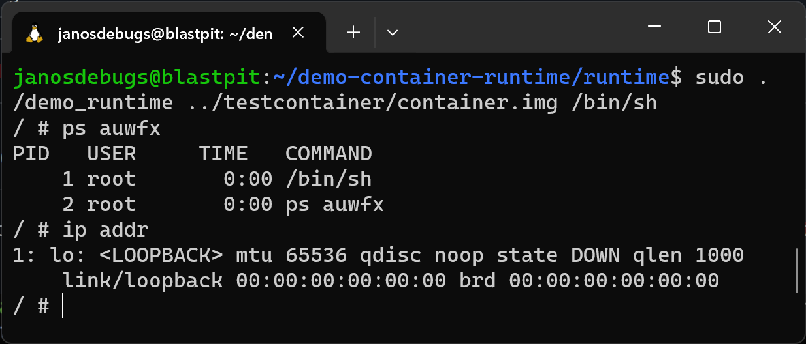

# Linux containers explained with code

This is a demo container runtime to showcase how various Linux features, like namespaces, are used to create containers.
Each folder contains a demo and a description on how it works so you can follow along.



## Start learning

This project is structured into two parts, each with a full description:

1. [Individual demos](demo)
2. [Complex container runtime](runtime)

Explore the folders and read the guides in each of them.

## Trying it out for yourself

If you want to try it out for yourself, you have to build it from source. However, note that this code is experimental.
It should be safe to run, but to be sure, **please run it on a virtual machine / dedicated
WSL instance.**

### Step 1: Build tools

In order to build these demos, you will need a Linux-based C++ toolchain and cmake installed. On Ubuntu 22.04, you can
install these packages:

```bash
$ sudo apt install build-essential cmake
```

### Step 2: Dependencies

In order to compile these demos, you will need to install the header files for libcap, libseccomp and zlib. On Ubuntu
you can do this by running:

```bash
$ sudo apt install libcap-ng-dev libseccomp-dev zlib1g-dev
```

### Step 3: Compiling

Once you have installed the dependencies, you can compile the source by running:

```bash
cmake .
make
```

Congratulations! Now each demo has a runnable binary in the folder. Follow the instructions in the individual folders
to run them!